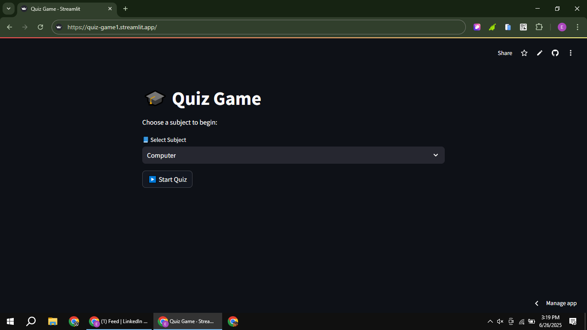
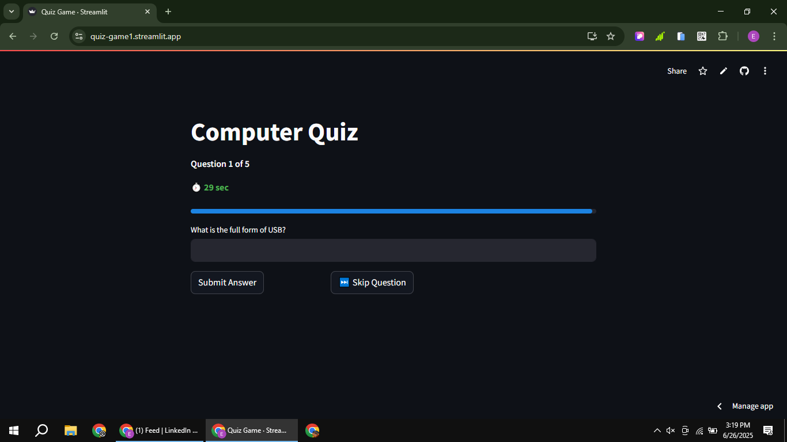
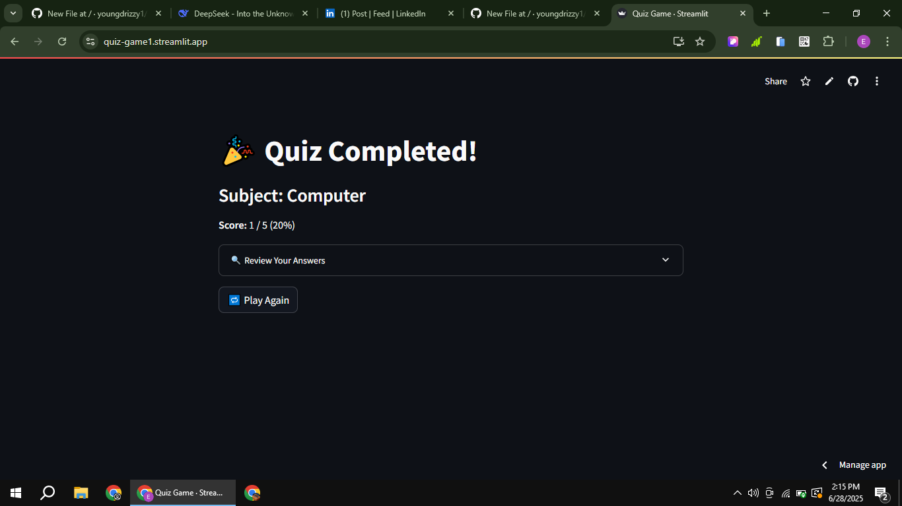

# 🎮 Interactive Quiz Game

[](https://quiz-game1.streamlit.app/)
[](https://www.linkedin.com/posts/eromosele-itoya_python-streamlit-webdevelopment-activity-7344006729745018882-pw1Z?utm_source=share&utm_medium=member_desktop&rcm=ACoAAEbDOGsBGINDr5uoWo3fkmNHZc_HI1Qst6k)

A dynamic quiz application built with Python and Streamlit that tests your knowledge across multiple subjects with a timer-based challenge!

## Features:
- **5 Subject Categories**: Computer, Math, Science, Geography, History
- **Randomized Questions**: 5 random questions selected from 20 per subject
- **Timer Challenge**: 30-second countdown per question
- **Score Tracking**: Real-time scoring with final review
- **Answer Review**: Detailed breakdown of correct/incorrect answers
- **Responsive Design**: Works on desktop and mobile

## Screenshots 📸
| Subject Selection | Quiz in Progress | Results Review |
|-------------------|------------------|----------------|
|  |  |  |

## Tech Stack 🛠️
- **Frontend**: Streamlit
- **Backend**: Python 3
- **Key Modules**: 
  - `streamlit` for UI
  - `random` for question randomization
  - `time` for timer functionality
  - `datetime` for time tracking

## Installation ⚙️
1. Clone repository:
```bash
git clone https://github.com/youngdrizzy1/Quiz-Game
cd quiz-game
```

2. Install dependencies:
```bash
pip install streamlit
```

3. Run the application:
```bash
streamlit run app.py
```

## How It Works 🔧
1. Select a subject from 5 categories
2. Answer 5 random questions within 30 seconds each
3. Submit or skip questions as needed
4. Review your score and answers at the end
5. Play again with new randomized questions

## Live Demo 🌐
Try the live version: [Quiz Game App](https://quiz-game1.streamlit.app/)

## Connect with Me 👋
[LinkedIn](https://www.linkedin.com/in/eromosele-itoya/) | 
[GitHub](https://github.com/youngdrizzy1)
